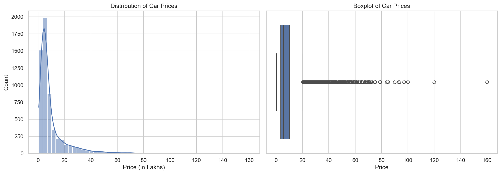
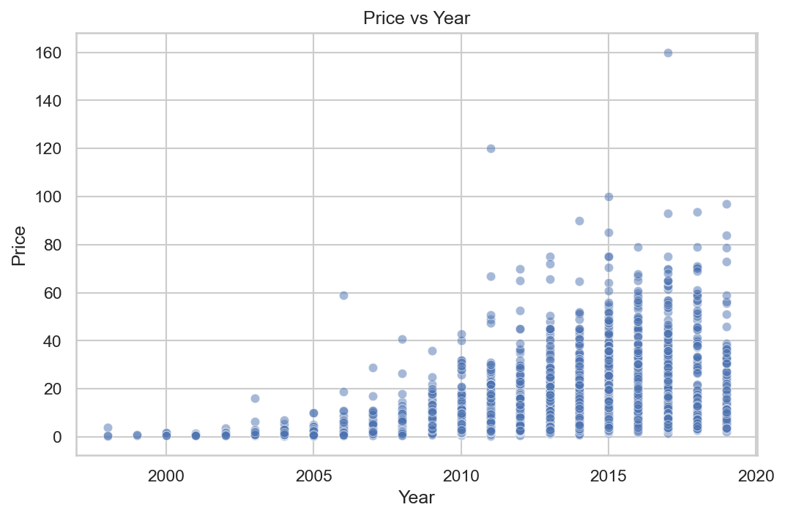
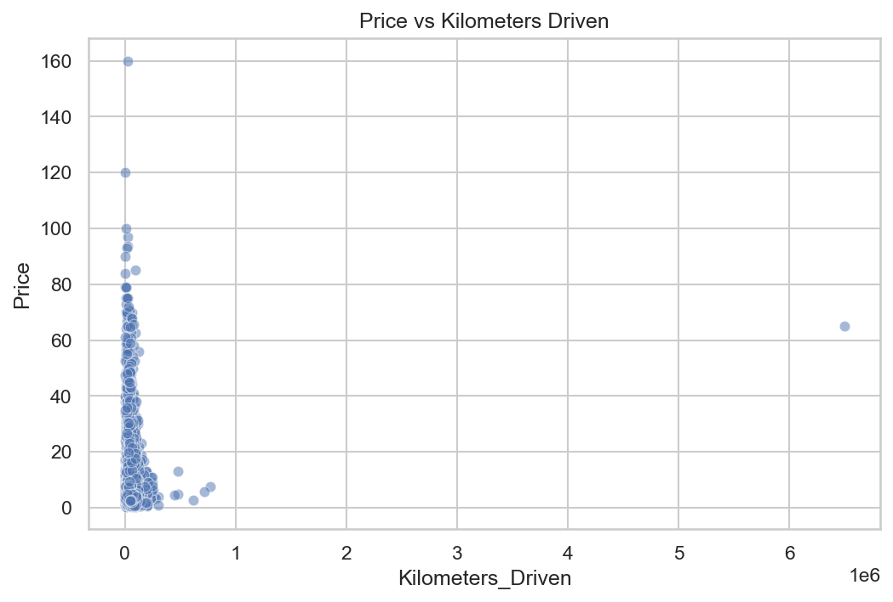
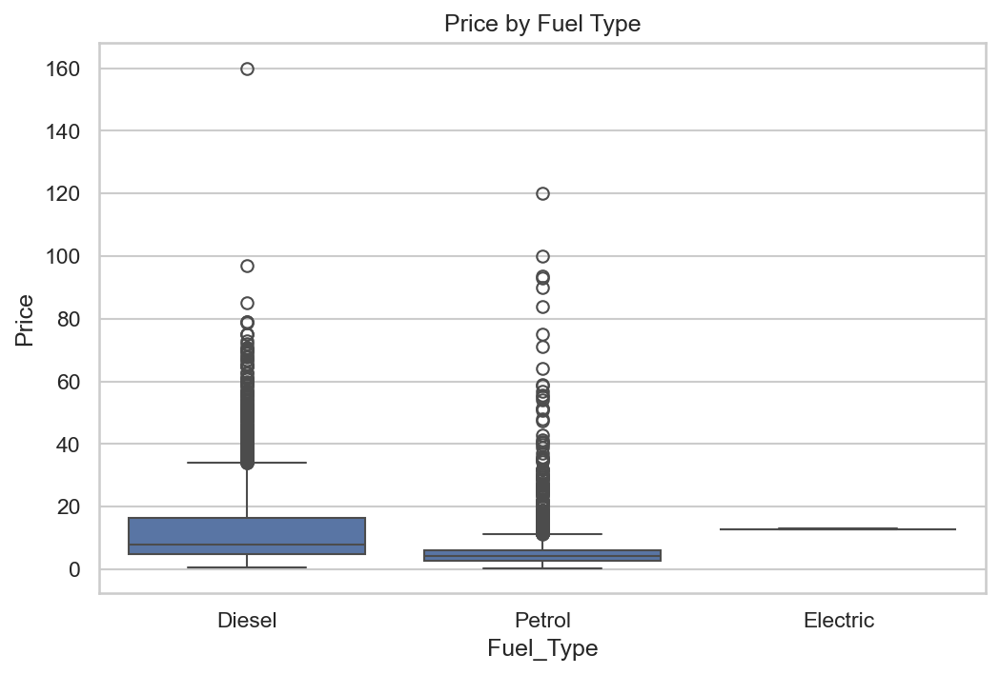
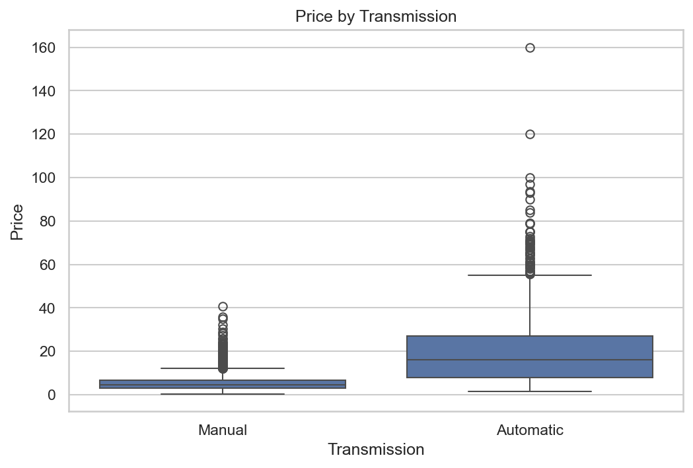
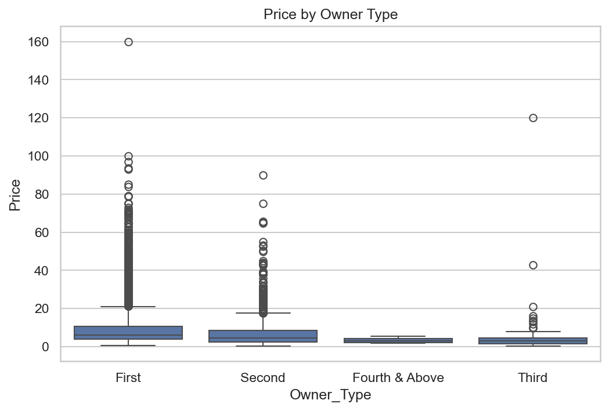
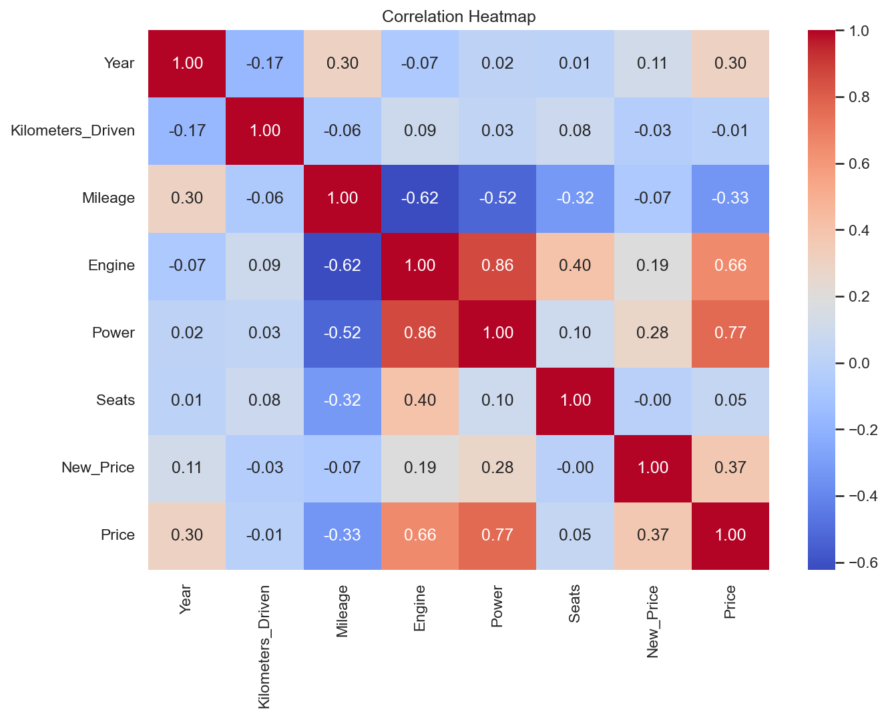

# 🚗 Used Car Price Analysis — Exploratory Data Analysis (EDA)


---

## 📌 Objective

The goal of this project is to explore a used car dataset and understand:
- What factors influence the selling price of cars
- How numerical and categorical features affect price
- Patterns, trends, and outliers in the data

This EDA prepares the dataset for building a **machine learning regression model** to predict car prices.

---

## 📊 Dataset Overview

| Metric | Value |
|--------|-------|
| **Total Records** | 5,847 |
| **Features** | 13 |
| **Average Price** | ₹9.65 Lakhs |
| **Price Range** | ₹0.44 - ₹160 Lakhs |
| **Year Range** | 1998 - 2019 |

### Features
- `Name`, `Location`, `Year`, `Kilometers_Driven`
- `Fuel_Type`, `Transmission`, `Owner_Type`
- `Mileage`, `Engine`, `Power`, `Seats`, `Price`

---

## 🔧 Data Cleaning Steps

1. **Dropped** unnecessary index column (`Unnamed: 0`)
2. **Removed** duplicate records
3. **Cleaned** text columns:
   - `Mileage`: "19.67 kmpl" → 19.67
   - `Engine`: "1582 CC" → 1582
   - `Power`: "126.2 bhp" → 126.2
   - `New_Price`: "8.61 Lakh" → 8.61
4. **Filled missing values**:
   - Numeric columns → Median
   - Categorical columns → Mode

---

## 📈 Visualizations & Analysis

### 1. Price Distribution & Boxplot
The price distribution is **right-skewed** with most cars priced between ₹3-15 Lakhs. Outliers visible in the boxplot indicate luxury/premium vehicles.

<p align="center">
  
</p>

---

### 2. Price vs Year
Newer cars tend to have higher prices, showing clear depreciation patterns.

<p align="center">
  
</p>

---

### 3. Price vs Kilometers Driven
Higher mileage doesn't strongly correlate with lower prices — other factors dominate.

<p align="center">
  
</p>

---

### 4. Price by Fuel Type
Diesel cars generally command higher prices than petrol vehicles.

<p align="center">
  
</p>

| Fuel Type | Count | Market Share |
|-----------|-------|--------------|
| Diesel | 3,161 | 54.1% |
| Petrol | 2,684 | 45.9% |
| Electric | 2 | <0.1% |

---

### 5. Price by Transmission Type
Automatic cars command a **significant price premium** over manual cars.

<p align="center">
  
</p>

| Transmission | Count | Market Share |
|--------------|-------|--------------|
| Manual | 4,135 | 70.7% |
| Automatic | 1,712 | 29.3% |

---

### 6. Price by Owner Type
First-owner cars have the widest price range and dominate the market.

<p align="center">
  
</p>

| Owner Type | Count | Percentage |
|------------|-------|------------|
| First | 4,811 | 82.3% |
| Second | 925 | 15.8% |
| Third | 103 | 1.8% |
| Fourth & Above | 8 | 0.1% |

---

### 7. Correlation Heatmap
Understanding relationships between all numerical features.

<p align="center">
  
</p>

**Key Correlations with Price:**
| Feature | Correlation | Interpretation |
|---------|-------------|----------------|
| Power | **+0.77** | Strong Positive ⬆️ |
| Engine | **+0.66** | Moderate Positive ⬆️ |
| Year | **+0.30** | Weak Positive ⬆️ |
| Mileage | **-0.33** | Weak Negative ⬇️ |
| Kilometers Driven | **-0.01** | Negligible ➖ |

---

## 🔑 Key Insights

| # | Insight | Impact |
|---|---------|--------|
| 1 | **Engine Power** has the strongest correlation with price (r=0.77) | 🔴 High |
| 2 | **Automatic transmission** cars are priced significantly higher | 🔴 High |
| 3 | **Diesel cars** are generally more expensive than petrol cars | 🟡 Medium |
| 4 | **Newer cars** (higher year) command higher prices | 🟡 Medium |
| 5 | **First-owner cars** dominate the market (82%) | 🟡 Medium |
| 6 | **Mileage** has a weak negative correlation - efficient cars are often smaller/cheaper | 🟢 Low |
| 7 | **Kilometers driven** has negligible impact on price | 🟢 Low |

---

## 🎯 Conclusions

1. **Power and Engine Size** are the most important factors determining car price
2. **Transmission type** is a significant categorical predictor — automatic cars cost more
3. **Year of manufacture** affects price positively — depreciation is evident
4. **Fuel type** influences price with diesel being more expensive on average
5. **Ownership history** — First-owner cars are dominant in the used car market
6. **Outliers exist** in price (luxury cars) and should be handled before ML modeling

---

## 🛠️ Tech Stack

| Tool | Purpose |
|------|---------|
| **Python 3.x** | Programming Language |
| **Pandas** | Data Manipulation |
| **NumPy** | Numerical Operations |
| **Matplotlib** | Plotting |
| **Seaborn** | Statistical Visualizations |
| **Jupyter Notebook** | Interactive Analysis |

---

## 📁 Project Structure

```
EDA/
├── 📄 README.md                    # Project documentation
├── 📓 eda.ipynb                    # Jupyter notebook with full analysis
├── 📊 train.csv                    # Original dataset
├── 📊 cleaned_used_car_data.csv    # Cleaned dataset
└── 🖼️ images/                      # Generated visualizations
    ├── price_distribution.png
    ├── price_vs_year.png
    ├── price_vs_km.png
    ├── price_by_fuel.png
    ├── price_by_transmission.png
    ├── price_by_owner.png
    └── correlation_heatmap.png
```

---

## 🚀 Next Steps

- [ ] Handle outliers in price column
- [ ] Feature engineering (brand extraction, age calculation)
- [ ] Build regression models (Linear, Random Forest, XGBoost)
- [ ] Model evaluation and comparison

---

## 📄 License

This project is open source and available for educational purposes.
